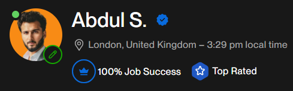

# Hi, I'm Abdul Salam! 👋

## 🚀 About Me
Highly skilled Flutter Developer with over 3 years of experience, recognized with a Top-Rated badge on Upwork and a perfect 100% JSS score. Currently pursuing MSc in Computer Science at University of East London, passionate about crafting clean, efficient mobile applications that deliver exceptional user experiences.

  
  <h1>Abdul S. </h1>
  

    
    
  

  
🌍 London, United Kingdom

## 💼 Current Role
- Freelance Flutter & FlutterFlow Developer on Upwork
- MSc Computer Science Student at University of East London

## 🛠️ Skills & Technologies

### Mobile Development

### Backend & Databases

### Programming Languages

### State Management
- BLoC
- Provider
- GetX

## 🎯 Notable Projects

### 🎵 Music App
- Built with FastAPI and PostgreSQL
- Features personalized playlists and offline playback
- Clean architecture implementation

### 🛒 Amazon-like E-commerce App
- Developed using Node.js and MongoDB
- Scalable backend architecture
- Real-time inventory management

### 🍽️ Restaurant Management System
- Implemented with Supabase
- Efficient order processing
- Table management system

### 👮 Security Guard Management System
- Large-scale platform connecting contractors and security guards
- Job placement and referral system
- Real-time communication features

## 📫 Connect With Me

## 📊 GitHub Stats

---
⚡ Fun fact: Currently enhancing my skills in Big Data Analytics, Cloud Computing, and AI & Machine Vision through my MSc program!
